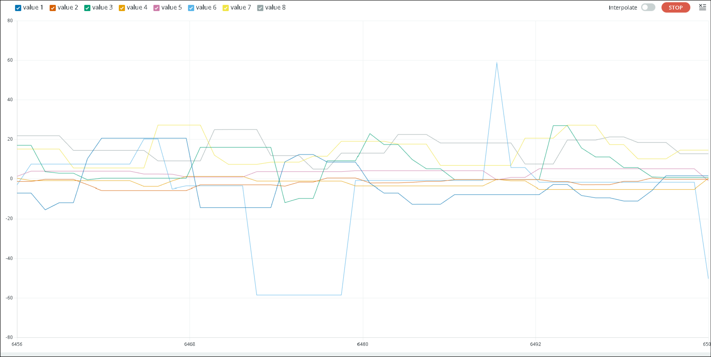

## 20th August 2025: Test and Update IMU Functions

Development started again today after two months. I tested the IMU functions on the actual board and updated them as needed, alongside some minor code improvements.

## 24th June 2025: Draft IMU Helper Functions

Today I created functions in the library for easily getting data from the IMU and printing it. This was accompanied by an example Arduino sketch. 
I am using the [SparkFun BNO08x Cortex Based IMU Library](https://github.com/sparkfun/SparkFun_BNO08x_Arduino_Library) for the BNO086.
